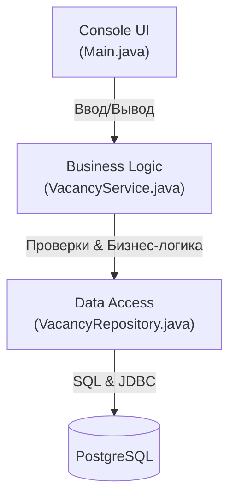
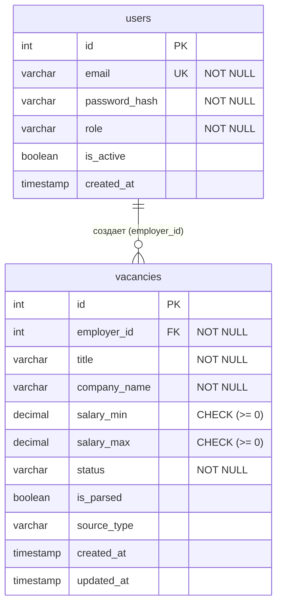
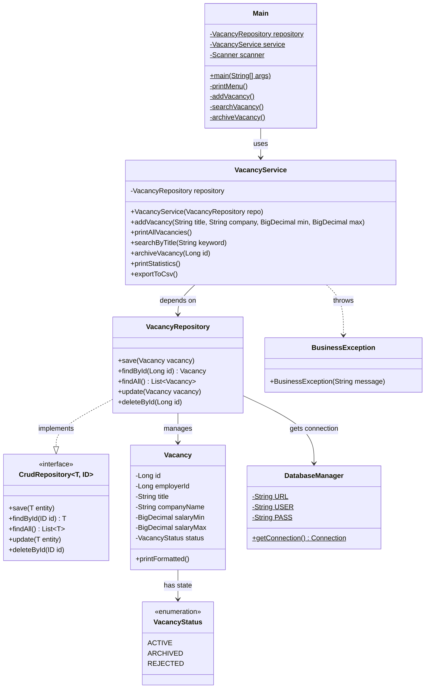
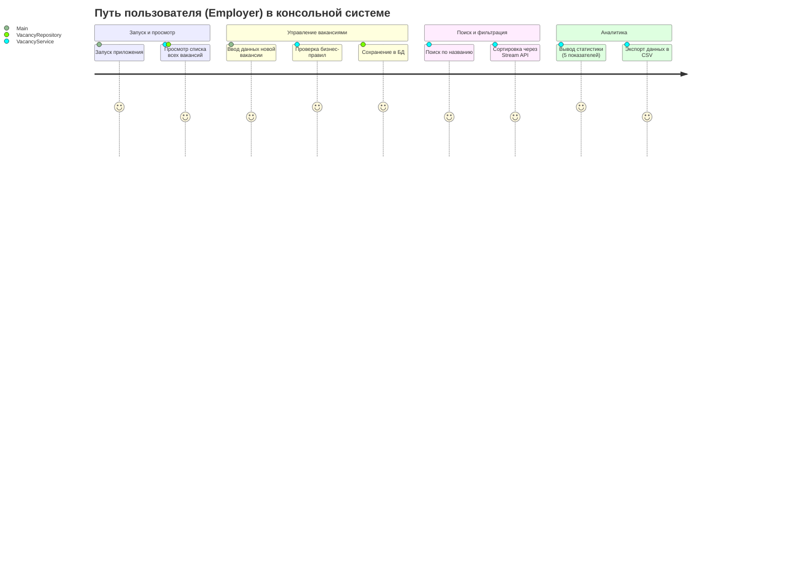

# HR System (Агрегатор вакансий) - Контрольная работа №1

Консольная информационная система управления вакансиями (HR System), разработанная на чистой Java (Pure Java) с использованием JDBC и PostgreSQL.

Проект полностью соответствует требованиям к КР1:
- Разделение на слои (UI, Service, Repository)
- Использование ООП, интерфейсов, полиморфизма
- Работа с базой данных через JDBC (`PreparedStatement`, `Connection`, `ResultSet`)
- Управление зависимостями вручную (без Spring)
- Использование Java Collections Framework и Stream API
- Консольное меню на основе `switch` выражений
- Безопасная обработка исключений (система не падает при ошибках ввода)

---

##  Архитектура проекта

Проект построен по классической многослойной архитектуре.



---

##  Схема базы данных (ER Diagram)

База данных состоит из двух связанных сущностей: `users` (дополнительная сущность) и `vacancies` (основная сущность).



**Ограничения на уровне БД:**
- Каскадное удаление (ON DELETE CASCADE)
- Проверка валидности зарплаты: `CHECK (salary_max >= salary_min)`

---

##  Диаграмма классов (Class Diagram)



---

##  Пользовательские сценарии (User Story Map)



---

##  Как запустить проект

### 1. Поднять базу данных

В проекте есть `docker-compose.yml`, который запускает PostgreSQL и pgAdmin:

```bash
docker-compose up -d
```

Это создаст:
- PostgreSQL на порту `5432` (база `hr_system_db`, пользователь `hr_user`, пароль `hr_password`)
- pgAdmin на порту `5050` (логин `admin@hrsystem.local`, пароль `admin123`)

> Если PostgreSQL уже стоит локально, docker не нужен — главное чтобы база, пользователь и пароль совпадали с тем, что в `DatabaseManager.java`.

### 2. Создать таблицы и заполнить тестовыми данными

```bash
psql -h localhost -U hr_user -d hr_system_db -f init.sql
```

Или через pgAdmin: открыть `http://localhost:5050`, подключиться к серверу, открыть Query Tool и вставить содержимое `init.sql`.

Скрипт создаст таблицы `users` и `vacancies`, добавит 5 пользователей и 10 вакансий.

### 3. Собрать и запустить

```bash
mvn clean compile
mvn exec:java -Dexec.mainClass="com.hrsystem.Main"
```

##  Реализованные бизнес-правила (согласно требованиям)

1. Нельзя создать запись без названия.
2. Зарплата не может быть отрицательной.
3. Максимальная зарплата не может быть меньше минимальной.
4. Отсутствие записи с указанным ID обрабатывается без падения программы.
5. Запрещенный переход статусов (нельзя перевести в архив вакансию, которая уже в архиве).
