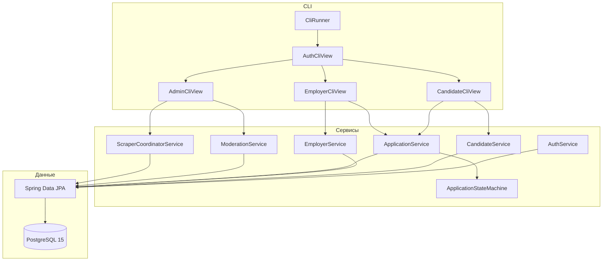
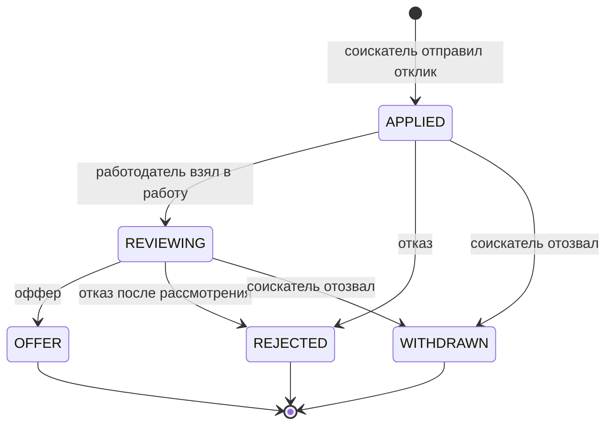

# HR-система: агрегатор вакансий и рекрутинг

Консольное приложение (Phase 1) для сбора вакансий с сайтов и Telegram, поиска работы, публикации позиций работодателем и ведения воронки отбора.

Стек: **Java 17**, **Spring Boot 3.3**, **PostgreSQL 15**, **Flyway**, **Jsoup**, **BCrypt**.

```
Соискатель ищет вакансии и откликается
Работодатель публикует позиции и ведёт воронку
Администратор запускает парсеры и модерирует каталог
```

---

## Содержание

1. [Что умеет система](#что-умеет-система)
2. [Быстрый старт](#быстрый-старт)
3. [Демо-аккаунты](#демо-аккаунты)
4. [Как пользоваться CLI](#как-пользоваться-cli)
5. [Архитектура](#архитектура)
6. [База данных](#база-данных)
7. [Правила откликов (state machine)](#правила-откликов-state-machine)
8. [Парсинг и дедупликация](#парсинг-и-дедупликация)
9. [Кто за что отвечает](#кто-за-что-отвечает)
10. [Структура проекта](#структура-проекта)
11. [Тесты](#тесты)
12. [Сценарий защиты](#сценарий-защиты)
13. [Частые проблемы](#частые-проблемы)

---

## Что умеет система

| Роль | Возможности |
| --- | --- |
| Гость | Вход, регистрация, просмотр каталога без отклика |
| Соискатель | Поиск с фильтрами и пагинацией по 10, отклик с письмом, «Мои отклики», отзыв заявки, профиль |
| Работодатель | Публикация вакансий вручную, редактирование, архив, воронка, смена статусов |
| Администратор | Дашборд, запуск парсинга сайтов и Telegram, источники, логи, модерация, блокировка пользователей |

Маркеры источника в каталоге:

- `[Сайт]` — собрано HTML-скрапером
- `[Telegram]` — собрано с публичного зеркала `t.me/s/...`
- `[Прямой работодатель]` — создано компанией вручную (`is_parsed = false`)

Архивные вакансии (`ARCHIVED`) в поиске соискателя **не показываются**.

---

## Быстрый старт

Нужны **Java 17+**, **Maven 3.9+**, **Docker Desktop**.

```bash
docker compose up -d
mvn clean package
java -jar target/hr-system.jar
```

Либо без сборки JAR:

```bash
mvn spring-boot:run
```

На Windows, чтобы кириллица в терминале отображалась нормально:

```bat
chcp 65001
java -Dfile.encoding=UTF-8 -jar target/hr-system.jar
```

После старта:

1. Flyway создаёт схему и индексы.
2. `SeedDataGenerator` добавляет демо-пользователей и вакансии (один раз).
3. Открывается главное меню CLI.

PostgreSQL: `localhost:5432`, база `hr_system_db`, пользователь `hr_user`, пароль `hr_password`.

pgAdmin: [http://localhost:5050](http://localhost:5050)  
логин `admin@hrsystem.local`, пароль `admin123`.

Параметры БД можно переопределить переменными из [`.env.example`](.env.example): `DB_HOST`, `DB_PORT`, `DB_NAME`, `DB_USER`, `DB_PASSWORD`.

---

## Демо-аккаунты

| Роль | Email | Пароль | Что уже есть в базе |
| --- | --- | --- | --- |
| Администратор | `admin@hrsystem.local` | `admin123` | доступ к парсерам и модерации |
| Работодатель | `employer@hrsystem.local` | `employer123` | компания TechNova, вакансии, входящий отклик |
| Соискатель | `candidate@hrsystem.local` | `candidate123` | профиль Ивана Петрова, отклик в статусе `APPLIED` |

Повторный запуск seed **не дублирует** пользователей: если `admin@hrsystem.local` уже есть, генератор пропускает наполнение.

---

## Как пользоваться CLI

### Главное меню

```
[1] Войти в систему
[2] Регистрация соискателя
[3] Регистрация работодателя
[4] Просмотр каталога (гость)
[0] Выход
```

Ввод защищён: буквы вместо цифр, пустые строки и битый email **не роняют** программу — система просит ввести значение заново.

### Соискатель

1. Каталог: страницы `[N]` / `[P]`, фильтры `[F]` (ключ, зарплата от, источник), детали `[D]`, отклик `[O]`.
2. Повторный отклик на ту же вакансию при статусе `APPLIED` или `REVIEWING` запрещён.
3. «Мои отклики»: статусы подсвечены цветом (синий `APPLIED`, жёлтый `REVIEWING`, зелёный `OFFER`, красный `REJECTED`).
4. Отзыв заявки доступен только из `APPLIED` и `REVIEWING` → статус `WITHDRAWN`.

### Работодатель

1. «Опубликовать вакансию» — должность, вилка, валюта, стек, описание, тип занятости.
2. «Мои вакансии» — статус и число откликов; можно править вилку, убрать в архив.
3. «Воронка» — письмо и контакты кандидата; действия: взять в работу, оффер, отказ (с комментарием).
4. Нельзя управлять чужими вакансиями и откликами.

### Администратор

1. Дашборд: сколько активных вакансий с сайтов / Telegram / вручную, время последнего сбора.
2. Запуск парсинга сайтов или Telegram — живой лог и отчёт: найдено / сохранено / дубликатов / ошибок.
3. Источники: добавить URL, включить или выключить.
4. Модерация: архив или отклонение вакансии; блокировка пользователей (админа блокировать нельзя).

---

## Архитектура

Слои независимы: CLI можно заменить на REST, не трогая сервисы и репозитории (это задумано как Phase 2).



Точка входа: [`HrApplication`](src/main/java/com/hrsystem/HrApplication.java) поднимает Spring без веб-сервера, вызывает seed, затем [`CliRunner`](src/main/java/com/hrsystem/delivery/cli/CliRunner.java).

Сессия консоли хранится в памяти в [`CliSessionContext`](src/main/java/com/hrsystem/delivery/cli/CliSessionContext.java) (текущий пользователь и профиль). Пароли в БД — только BCrypt (cost 10).

---

## База данных

Схема создаётся **только через Flyway**, Hibernate работает в режиме `validate`.

| Миграция | Файл | Что делает |
| --- | --- | --- |
| V1 | [`V1__init_schema.sql`](src/main/resources/db/migration/V1__init_schema.sql) | ENUM-типы и таблицы |
| V2 | [`V2__add_indexes.sql`](src/main/resources/db/migration/V2__add_indexes.sql) | индексы, запрет дубль-откликов, полнотекстовый поиск |
| V3 | [`V3__seed_initial_data.sql`](src/main/resources/db/migration/V3__seed_initial_data.sql) | стартовые источники парсинга |

Основные таблицы: `users`, `candidate_profiles`, `employer_profiles`, `vacancies`, `applications`, `parsing_sources`, `parsing_logs`.

Защита от спама откликами на уровне БД:

```sql
CREATE UNIQUE INDEX uq_candidate_active_application
    ON applications(vacancy_id, candidate_id)
    WHERE status IN ('APPLIED', 'REVIEWING');
```

Поиск в каталоге идёт только по `status = ACTIVE`. Фильтры: ключевое слово (должность, компания, стек, описание), минимальная зарплата, источник.

---

## Правила откликов (state machine)

Класс [`ApplicationStateMachine`](src/main/java/com/hrsystem/domain/state/ApplicationStateMachine.java) — единственное место, где разрешены переходы. Обход через CLI невозможен.



| Откуда | Куда | Кто |
| --- | --- | --- |
| (новый) | `APPLIED` | соискатель |
| `APPLIED` | `REVIEWING`, `REJECTED` | работодатель |
| `APPLIED` | `WITHDRAWN` | соискатель |
| `REVIEWING` | `OFFER`, `REJECTED` | работодатель |
| `REVIEWING` | `WITHDRAWN` | соискатель |
| `OFFER` / `REJECTED` / `WITHDRAWN` | любой | **запрещено** |

Попытка `OFFER → APPLIED` завершается ошибкой `InvalidStateTransitionException` с понятным текстом в консоли.

---

## Парсинг и дедупликация

Админ запускает сбор из меню. Координатор [`ScraperCoordinatorService`](src/main/java/com/hrsystem/scraper/ScraperCoordinatorService.java):

1. Берёт **активные** источники из `parsing_sources`.
2. Сайты — [`HtmlWebScraper`](src/main/java/com/hrsystem/scraper/HtmlWebScraper.java) (Jsoup, пагинация до 5 страниц, пауза 500 мс).
3. Telegram — [`TelegramMirrorScraper`](src/main/java/com/hrsystem/scraper/TelegramMirrorScraper.java) по `https://t.me/s/<канал>` без Bot API.
4. Текст чистится, зарплата разбирается regex в `salary_min` / `salary_max` / валюту.
5. Дубликаты отсекаются по SHA-256 (`title + company + description`) и по `source_url`.
6. Новые записи сохраняются с `is_parsed = true`; итог пишется в `parsing_logs`.

Стартовые источники (V3): Habr Career и зеркала `t.me/s/java_jobs`, `t.me/s/it_vacancies`. Источник можно отключить, если сайт недоступен — CLI не падает, в отчёте будет ошибка источника.

Повторный запуск того же источника должен дать **0 новых** и рост счётчика дубликатов (идемпотентность).

Настройки скрапера — блок `hr.scraper` в [`application.yml`](src/main/resources/application.yml): User-Agent, таймауты 10 с, число повторов, глубина пагинации.

---

## Кто за что отвечает

Документ для команды: какой пакет смотреть, если нужно править свою зону.

| Участник | Зона | Где в коде |
| --- | --- | --- |
| **Эдик** | Docker, Flyway, сущности, репозитории, seed | `docker-compose.yml`, `db/migration`, `domain/entity`, `repository`, `SeedDataGenerator` |
| **Максим** | Сбор, очистка, зарплаты, хэш, оркестратор | `scraper/*`, `dto/parser`, `dto/response/ParsingReportDto` |
| **Дамир** | Регистрация/вход, BCrypt, каталог, отклики соискателя | `AuthService`, `CandidateService`, `CliSessionContext`, `AuthCliView`, `CandidateCliView` |
| **Глеб** | Работодатель, воронка, state machine, админка, таблицы CLI | `EmployerService`, `ApplicationService`, `ModerationService`, `ApplicationStateMachine`, `EmployerCliView`, `AdminCliView`, `CliRunner`, `utils` |

Общие контракты:

- Глеб вызывает `ScraperCoordinatorService.runWebsiteScraping()` / `runTelegramScraping()`.
- Дамир показывает в каталоге вакансии Эдика/Максима и статусы, которые меняет Глеб.
- Эдик даёт `existsByContentHash`, фильтр `searchActive`, выборку откликов по вакансии.

---

## Структура проекта

```
src/main/java/com/hrsystem/
├── HrApplication.java              точка входа
├── config/                         BCrypt, свойства скрапера
├── domain/entity/                  JPA-сущности
├── domain/enums/                   роли, статусы, валюты, источники
├── domain/state/                   ApplicationStateMachine
├── repository/                     Spring Data JPA
├── dto/                            запросы, ответы, сырой парсинг
├── service/                        бизнес-логика и seed
├── scraper/                        HTTP, HTML, Telegram, hasher
├── delivery/cli/                   меню, сессия, таблицы, валидатор
└── exception/                      понятные ошибки для CLI

src/main/resources/
├── application.yml
├── banner.txt
└── db/migration/                   V1, V2, V3

src/test/java/                      юнит-тесты модулей Глеба и парсера
```

---

## Тесты

```bash
mvn test
```

Покрыто без живой PostgreSQL (Mockito + чистая логика):

- все разрешённые и запрещённые переходы state machine
- создание ручной вакансии (`MANUAL`, `ACTIVE`, `is_parsed = false`)
- запрет править чужую вакансию
- смена статуса, терминальные состояния, дубль-отклик
- таблицы CLI, безопасный ввод, парсер зарплат, SHA-256

---

## Сценарий защиты

Короткий прогон на 5 минут.

1. **База.** `docker compose up -d`, в логах приложения — успешный Flyway. По желанию открыть pgAdmin.
2. **Парсинг.** Войти как админ → запустить HTML или Telegram → показать отчёт. Запустить ещё раз: новые ≈ 0, дубликаты выросли.
3. **Соискатель.** Войти как `candidate@hrsystem.local` → каталог, фильтр например `Java` → «Мои отклики» со статусом `APPLIED`.
4. **Работодатель.** Войти как `employer@hrsystem.local` → воронка → `REVIEWING` → `OFFER`. Попробовать вернуть в `APPLIED` — отказ автомата.
5. **Каталог.** Создать вакансию вручную — в поиске маркер `[Прямой работодатель]`. Убрать в архив — из поиска пропадает.

---

## Частые проблемы

**Порт 5432 занят.** Остановить локальный PostgreSQL или сменить проброс в `docker-compose.yml` и `DB_PORT`.

**Приложение не видит БД.** Сначала дождаться `docker compose up -d` (healthcheck Postgres), потом запускать JAR.

**Кракозябры в Windows-терминале.** `chcp 65001` и `-Dfile.encoding=UTF-8`.

**Парсер вернул 0 вакансий.** Сайт мог сменить вёрстку или ответить 403. Это не падение CLI: в отчёте будет ошибка или ноль карточек. Добавьте другой активный URL в админке.

**Seed не создал пользователей.** Они уже есть. Либо логиньтесь демо-аккаунтами, либо удалите том `pgdata` (`docker compose down -v`) и поднимите базу заново — **все данные сотрутся**.

**Hibernate `validate` не проходит.** Схема должна совпадать с Flyway. Не включайте `ddl-auto: update`. На чистой базе миграции V1–V3 применяются сами.

Phase 2 (REST API и веб-интерфейс) в этом репозитории **не реализована**: домен и репозитории рассчитаны на переиспользование без переписывания бизнес-логики.
